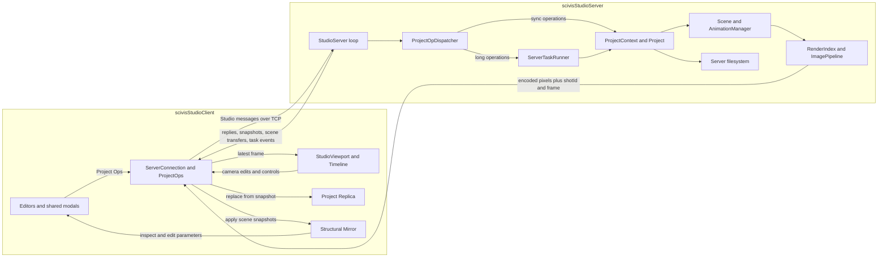
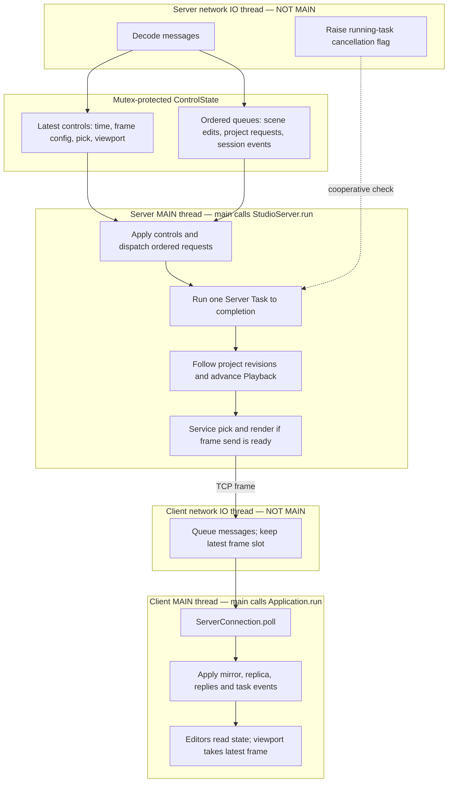

# SciVis Studio server/client architecture

**[Open the interactive architecture atlas](scivis-studio-architecture.html)**
in a browser. It works offline: select a subsystem to see its responsibilities
and source links. Six views cover the system, client, server, threading,
shared code/tests, and end-to-end actions. Zoom controls help with the larger maps.

This guide describes `studio-remote` at `f54c883`, compared with its merge-base
with `main`, `11f0d31`. It is based on the implementation and CMake targets,
not just the original design proposal. Shared VSR/Studio components below
already existed and were extended; `scivisStudioRemote/` is new on this branch.

## Start with ownership

The server owns identity, project lifecycle, dataset residency, files, animation
and ANARI rendering. The client owns interaction and presentation. Its Project
Replica is read-only; its Structural Mirror contains the full scene structure
with every parameter, and arrays as descriptors only. Camera and other editable
parameter values can change optimistically in the mirror.

“Thin client” describes runtime responsibilities: the client still links the
shared Studio model and VSR libraries. It has a presentation ImagePipeline,
but does not render the ANARI scene or run an AnimationManager.

## Find a subsystem

Paths below are relative to `src/apps/interactive/` unless marked otherwise.

| Subsystem | Responsibility | Start reading |
|---|---|---|
| Client composition | Windows, menus, connection lifecycle, UI State, errors | [client/Application.h](../src/apps/interactive/scivisStudioRemote/client/Application.h) |
| Client connection core | Hello/bootstrap, queues, mirror application, liveness and retry | [client/ServerConnection.h](../src/apps/interactive/scivisStudioRemote/client/ServerConnection.h) |
| Project Ops and task tracking | Request IDs, reply callbacks, Project Replica and task records | [client/ProjectOps.h](../src/apps/interactive/scivisStudioRemote/client/ProjectOps.h) |
| Editors | Read replica; submit project operations through a shared editor context | [client/EditorContext.h](../src/apps/interactive/scivisStudioRemote/client/EditorContext.h), [windows/](../src/apps/interactive/scivisStudioRemote/client/windows/) |
| Optimistic edits | Mirror parameter callbacks become outbound scene edits | [client/MirrorUpdateDelegate.cpp](../src/apps/interactive/scivisStudioRemote/client/MirrorUpdateDelegate.cpp) |
| Viewport and timeline | Decode/display images; camera interaction, picking, scrubbing | [client/StudioViewport.h](../src/apps/interactive/scivisStudioRemote/client/StudioViewport.h), [Timeline.cpp](../src/apps/interactive/scivisStudioRemote/client/windows/Timeline.cpp) |
| Shared dialogs | BrowseProvider chooses paths; ModalAction submits local or remote operations | [scivisStudio/modals/](../src/apps/interactive/scivisStudio/modals/), [RemoteProjectActions.h](../src/apps/interactive/scivisStudioRemote/client/modals/RemoteProjectActions.h) |
| Wire protocol | Studio-specific message set, typed DataTree payloads, frame encoding | [protocol/StudioProtocol.h](../src/apps/interactive/scivisStudioRemote/protocol/StudioProtocol.h), [StudioCodec.h](../src/apps/interactive/scivisStudioRemote/protocol/StudioCodec.h), [FrameCodec.h](../src/apps/interactive/scivisStudioRemote/protocol/FrameCodec.h) |
| Server orchestration | Session state, input handoff, loop, bootstrap, revision following | [server/StudioServer.h](../src/apps/interactive/scivisStudioRemote/server/StudioServer.h) |
| Project request dispatch | Validation, ordering, sync operations and task launch | [server/ProjectOpDispatcher.h](../src/apps/interactive/scivisStudioRemote/server/ProjectOpDispatcher.h), [ProjectOpDispatcherTasks.cpp](../src/apps/interactive/scivisStudioRemote/server/ProjectOpDispatcherTasks.cpp) |
| Server Tasks | Single-lane execution, progress, cancellation, retained endings | [server/ServerTaskRunner.h](../src/apps/interactive/scivisStudioRemote/server/ServerTaskRunner.h) |
| Shared Studio model | Project/dataset/shot/rig operations, revisions, persistence | [scivisStudio/ProjectContext.h](../src/apps/interactive/scivisStudio/ProjectContext.h), [ProjectSerialization.h](../src/apps/interactive/scivisStudio/ProjectSerialization.h) |
| Scene synchronization | Records structural changes; one whole-scene transfer at each commit point | [server/ServerPushDelegate.h](../src/apps/interactive/scivisStudioRemote/server/ServerPushDelegate.h) |
| Playback and viewport rendering | Server clock, picking, AOVs, outlines and bounds | [server/Playback.h](../src/apps/interactive/scivisStudioRemote/server/Playback.h), [ViewportPasses.cpp](../src/apps/interactive/scivisStudioRemote/server/ViewportPasses.cpp) |
| Server files and queries | Allowed roots, directory metadata, array histograms | [server/DataRoots.h](../src/apps/interactive/scivisStudioRemote/server/DataRoots.h), [RemoteBrowse.cpp](../src/apps/interactive/scivisStudioRemote/server/RemoteBrowse.cpp), [ArrayHistogram.cpp](../src/apps/interactive/scivisStudioRemote/server/ArrayHistogram.cpp) |
| Headless client | Script the same connection core; record/assert results; optionally spawn server | [test_client/README.md](../src/apps/interactive/scivisStudioRemote/test_client/README.md), [TestSession.h](../src/apps/interactive/scivisStudioRemote/test_client/TestSession.h) |
| Transport foundation | TCP framing, asynchronous sends, connection lifecycle | [src/vsr/network/NetworkChannel.hpp](../src/vsr/network/NetworkChannel.hpp) |

## The thread boundaries

**The server loop is the server executable's main thread. The UI loop is the
client executable's main thread.** Neither loop is launched as a background
thread by its application. Each process has its own main thread.

| Process / thread | Main thread? | Work performed |
|---|---|---|
| Server: `main()` → `StudioServer::start()` → `run()` | **Yes** | Startup, project/scene mutations, request dispatch, bootstrap, Server Task bodies, filesystem operations, playback, ANARI/pipeline calls, picking and frame encoding |
| Server: `NetworkChannel::m_io_thread` | No | Asio accept/read/write, Hello and Ping/Pong handling, decode and queue/latch inputs, report connection events, raise running-task cancel/shutdown flags |
| GUI client: `main()` → `Application::run()` → `mainLoop()` | **Yes** | SDL/ImGui, `uiFrameStart()` → `ServerConnection::poll()`, mirror/replica updates, reply callbacks, task records, liveness/retry decisions, editor actions, frame decoding and texture presentation |
| GUI client: `NetworkChannel::m_io_thread` | No | Asynchronous resolve/connect/read/write, timestamp traffic, answer Ping, queue inbound messages, replace the latest-frame slot, latch connection loss |
| GUI client: inherited `Application::m_jobs` worker | No | Generic `vsr::core::TaskQueue` worker created by the UI base class. Remote project operations and Server Tasks do not run here; it waits when no generic UI work is queued |
| Headless test client: `main()` → `CommandRunner::run()` | **Yes** | Execute scripts and drive `TestSession`/`ServerConnection::poll()` instead of a GUI; its NetworkClient still has a separate IO thread |

The main-thread assignments follow the actual entry points:
[server main](../src/apps/interactive/scivisStudioRemote/server/scivisStudioServer.cpp),
[client main](../src/apps/interactive/scivisStudioRemote/client/scivisStudioClient.cpp),
[UI main loop](../src/vsr/ui/imgui/Application.cpp), and
[test-client main](../src/apps/interactive/scivisStudioRemote/test_client/scivisStudioTestClient.cpp).
[NetworkChannel::start_messaging()](../src/vsr/network/NetworkChannel.cpp)
creates its IO thread to run the Asio context.
[Application::m_jobs](../src/vsr/ui/imgui/Application.h) constructs the
[TaskQueue worker](../src/vsr/core/TaskQueue.hpp).

Server Tasks are asynchronous **from the client's perspective**, but their
bodies execute on the server main thread. Interactive frames pause while a body runs.
An exclusive RenderShot also refuses competing mutations while queued/running.
The network thread can signal cancellation without waiting for the loop.

The handoff has two different rules: interactive controls retain the latest
value, while scene edits, project requests and session events retain their
order. On the client, the IO thread only stores the newest frame message;
pixel decoding happens later on the UI main thread in StudioViewport.
Calling `send()` on a main thread queues transport work for the IO thread;
serializing or encoding a message is still work on the calling thread.

Consequently, during a long server task the network can continue writing
progress and answering Ping, and cancellation can set its atomic flag.
Operations requiring the server loop wait until the running body returns;
receiving a request does not mean the server can execute it immediately.
Likewise, a slow client decode or UI frame delays `poll()` and editor refresh,
although network reception continues and the latest-frame slot can be replaced.

These diagrams describe the application scheduling model, not a fixed OS thread
count: ANARI backends, drivers, importers or other dependencies may create their
own workers. The server calls its interactive ANARI scene pass synchronously
(`setRunAsync(false)`); backend-internal CPU/GPU execution is separate from the
Studio thread that owns scene and project state.

Two lifecycle/testing exceptions help when navigating the code:

- Local `NetworkChannel::disconnect()` / `stop()` can report closure on the
  calling thread, after joining IO, rather than on IO. Closure callbacks still
  hand off state instead of modifying UI/project objects directly.
- In-process tests use [ServerLoop](../src/tests/StudioServerTestHelpers.h) to
  run `StudioServer::run()` on a **non-main test thread**. This changes which
  thread drives the loop, not the loop's ownership rule. The headless client's
  `--spawn-server` option instead starts a separate server process, with its
  own main thread.

## Three independent return paths

| Return path | What changes on the client | Why it is separate |
|---|---|---|
| ProjectSnapshot | Replaces the whole Project Replica | A revision-driven commit marker for project mutations |
| Structural scene transfer | Replaces objects/layers in the Structural Mirror | Preserves server identities and parameter values without sending bulk dataset arrays |
| Frame header + pixels | Updates the displayed image and In-Motion Time | Keeps image/time paired without a project snapshot on every frame |

A ProjectOpReply resolves a request; it does not itself replace the replica.
The scene message for a mutation precedes its trailing snapshot; a mutation
that leaves the scene alone sends none. The implementation emits snapshots for
revision changes, including failed operations that leave recorded state;
refused and no-op operations have no snapshot.

Editable parameter changes travel from the mirror through MirrorUpdateDelegate,
with no success reply for each drag. Applying inbound changes suppresses the
outbound delegate. ServerPushDelegate only records that the scene changed; the
server serializes it once, at the commit point, so an object reaches the mirror
with the parameters its importer set rather than as the empty shell it was at
creation.

## Read one action end to end

The atlas's **Follow an action** view walks through bootstrap, project edits,
camera orbit, Server Tasks and playback. For a first code-reading pass:

1. [Application::uiFrameStart](../src/apps/interactive/scivisStudioRemote/client/Application.cpp)
   → [ServerConnection::poll](../src/apps/interactive/scivisStudioRemote/client/ServerConnection.cpp).
2. [ProjectOps](../src/apps/interactive/scivisStudioRemote/client/ProjectOps.cpp)
   → [ProjectOpDispatcher](../src/apps/interactive/scivisStudioRemote/server/ProjectOpDispatcher.cpp)
   → [ProjectContext](../src/apps/interactive/scivisStudio/ProjectContext.cpp).
3. [StudioServer::followProjectRevisions and bootstrap](../src/apps/interactive/scivisStudioRemote/server/StudioServer.cpp)
   → the replica/mirror update paths in ServerConnection.
4. [StudioServer::run and sendRenderedFrame](../src/apps/interactive/scivisStudioRemote/server/StudioServer.cpp)
   → [StudioViewport::takeLatestFrame](../src/apps/interactive/scivisStudioRemote/client/StudioViewport.cpp).

For a longer guided tour, use the existing
[learning plan](scivis-studio-remote-learning-plan.md). The
[Remote glossary](../src/apps/interactive/scivisStudioRemote/CONTEXT.md) defines
the terms used here; [ADRs 0028–0035](adr/README.md) explain the ownership and
synchronization decisions.
