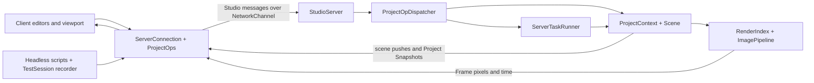

# Learning the SciVis Studio remote branch

Prepared for Jefferson on 2026-09-08, against `studio-remote` at `0a12a91`.
Comparison: merge base with local `main`,
`11f0d31d5e7bc5c3fae6c0aeb15a614d3bf762d2`.
That comparison contains 363 commits and 304 changed files, with 53,419
insertions and 1,783 deletions (including documentation and tests).

The goal is independent ownership: being able to explain an operation across
both processes, predict its behavior under failure, and identify where a change
belongs. Familiar VSR and Studio concepts are prerequisites; we only revisit
them where this branch changes their contracts.

This plan is based on reading the branch diff, the central server/client
implementations, protocol and model interfaces, selected tests and scenarios,
and the quality-ticket index and relevant decision follow-ups in
`~/todo/vela/studio-remote-pr-quality`. It is an architectural learning review,
not an exhaustive correctness audit. No executable tests were run for this plan.

## The starting picture

The important new system is the agreement between several representations of
state, and the rules for moving between them.

| State | Owner | What the client receives | How it changes |
|---|---|---|---|
| Project and dataset lifecycle | Server `ProjectContext` | Read-only Project Replica | Project Ops and whole Project Snapshots |
| Scene structure and identity | Server Scene | Structural Mirror, retaining server indices | Server pushes and structural requests |
| Editable scene parameters | Server Scene plus optimistic client mirror edits | Parameter values | Mirror delegate sends edits; inbound application suppresses echoes |
| Bulk dataset contents and files | Server | Descriptors, metadata, server paths | Server Tasks and Remote Browse |
| Displayed image and In-Motion Time | Server rendering | Frame pixels and header | Latest-Frame-Wins delivery |
| Client selection, windows, interaction | Client UI | Locally held state; saved UI State returned by server | UI actions and opaque persistence |
| Task execution and retained endings | Server task runner | Progress, endings, bootstrap replay | Single-lane execution and cooperative cancellation |



The server IO thread receives and marshals input; the server loop owns scene
and project mutation. On the client, network callbacks queue messages and
`ServerConnection::poll()` applies them on the driving thread. These thread
boundaries are as important as the process boundary.

## How we should work through it

Use eight sessions of roughly 45–60 minutes, adjusting to the questions that
come up. Sessions 1–4 establish the core model; 5–8 complete operational and
maintenance ownership. The headless client is a teaching instrument from the
first session, but its implementation comes near the end.

Each session follows the same pattern:

1. Start with one user action and predict what changes where.
2. Draw the relevant ownership or message sequence together.
3. Read a short path through named functions, opening helpers only as needed.
4. Inspect or run one existing scenario and one focused test case.
5. Explain the trace back without looking, including a failure case.

Keep a running one-page ownership map and a list of surprising rules. Reading
entire directories or the 363 commits in order would obscure those rules.
Use the large remote README as a decision reference, rather than prerequisite
reading. Ticket history explains the current code; it is not the lesson order.

## 1. Connect and populate a client

**Question:** What actually exists on each side when the editor becomes usable?

Read [ADRs 0028–0030](adr/README.md), then the declarations in
[StudioServer.h](../src/apps/interactive/scivisStudioRemote/server/StudioServer.h)
and [ServerConnection.h](../src/apps/interactive/scivisStudioRemote/client/ServerConnection.h).
Trace server `beginSession()` → `bootstrap()` and client `handleHello()` →
`handleMessage()` through `BootstrapBegin`, `ProjectSnapshot`, `BootstrapEnd`.
Finish at `canSend()` and the application's bootstrap callbacks.

Draw the bootstrap contents in wire order and distinguish Connection State
from Session Phase. `Connected` does not yet mean editable. Explain why the
server can render data that the client does not hold, and why replacing a
mirror requires dropping references before destroying its objects.

Use `test_client/scenarios/session.studio` and the test
“ServerConnection handshakes and bootstraps” in
[test_StudioClientConnection.cpp](../src/tests/test_StudioClientConnection.cpp).

**Checkpoint:** Explain where a client camera object came from, who chose its
index, and exactly what permits the first edit. Produce the ownership map.

## 2. Change one shot field and wait for the truth

**Question:** What does changing a shot's FPS actually commit?

Trace one control in
[client/windows/ShotEditor.cpp](../src/apps/interactive/scivisStudioRemote/client/windows/ShotEditor.cpp)
through `ProjectOps`, `UpdateShot{shotId, patch}`, the dispatcher handler,
`ProjectContext::updateShot()` and `ShotOps`. Then follow
`StudioServer::dispatchPendingRequests()` → `followProjectRevisions()` →
`sendProjectSnapshot()` → client replica replacement.

Read only that payload's field description first. Then open
[StudioCodec.h](../src/apps/interactive/scivisStudioRemote/protocol/StudioCodec.h),
[PayloadCommon.h](../src/apps/interactive/scivisStudioRemote/protocol/PayloadCommon.h),
and the model's `DataNodeFields.h` to explain how one field description serves
encoding and decoding. `ProjectSnapshot.cpp` leads to the existing Project
serializer's new `ProjectForm::Full`; compare it with the manifest form.

Separate four facts: scene notifications, dirty state, `revision()`, and
`activeShotRevision()`. A successful reply is not replica replacement. A
refused/no-op operation need not produce a snapshot; a failed operation that
leaves a changed dataset record can produce one. Raw scene edits and moving
playback time are deliberately outside the whole-op revision rule.

Use the shot-edit portion of
[project_lifecycle.studio](../src/apps/interactive/scivisStudioRemote/test_client/scenarios/project_lifecycle.studio),
including its invalid rig and clamped frame cases. Match it to
`test_StudioServerProjectOps.cpp` and `test_StudioClientProjectOps.cpp`.

**Checkpoint:** Predict two windows editing different fields of the same shot.
Explain why a Shot Patch avoids stale whole-shot replacement, and why a pointer
into the replica cannot be retained across the next snapshot.

Quality tickets to consult afterward: **01–06, 14**.

## 3. Edit the scene without making an echo loop

**Question:** Why does editing a material feel immediate, while creating a
project entity waits for the server?

Trace [MirrorUpdateDelegate::sendParameter()](../src/apps/interactive/scivisStudioRemote/client/MirrorUpdateDelegate.cpp)
→ `SetObjectParameter` → server `onMessage()` → `applyControlState()` →
`applyEdit()`. Then trace a server-originated change through `ServerPushDelegate`
and client `applySceneMessage()`.

Draw the two places outbound delegates are disabled. This is origin-based
suppression, not comparison of old and new values. Distinguish parameter edits,
node transforms, structural operations, and bulk arrays; the optimistic path
does not authorize arbitrary client-side scene creation.

Follow server identity preservation into the changed `ObjectPool::insert_at()` /
`emplace_at()`, `Forest::insert_last_child_at()`, and layer serialization. Read
the changed portions, not the familiar containers in full. Track a sparse node
index through a transfer.

Use `scene_edits.studio`, `test_StudioProtocol_Scene.cpp`, and the sparse-slot
cases in `test_ObjectPool.cpp` / `test_Forest.cpp`.

**Checkpoint:** Explain why a received parameter push does not go back onto the
wire, and what the client does when a scene message cannot be applied. Do not
assume optimistic edits have the Project Op reply/snapshot contract.

Quality tickets: **04, 17, 18**; ADRs **0029, 0030, 0033**.

## 4. Follow one server-loop iteration and one image

**Question:** What happens if the UI changes time repeatedly while an image is
still being sent?

Read [StudioServer::run() and applyControlState()](../src/apps/interactive/scivisStudioRemote/server/StudioServer.cpp).
Draw the actual processing lanes: ordered session events with connection
serials, ordered scene edits, ordered project requests, and latest-value control
slots. These do not form one globally ordered queue. Explain what coalesces,
what must be retained, and why session events are processed first.

Continue through `Playback::applyTime()` / `tick()` / `commitScrubIfQuiet()`,
`renderAndSendFrame()` / `sendRenderedFrame()`, `FrameMessages`, `FrameCodec`,
and client `takeLatestFrame()` / `StudioViewport`. Read `ViewportPasses` and
`servicePendingPick()` as branches off this same image path.

There are two distinct pacing mechanisms: the server skips rendering while its
previous frame send is unfinished; the client keeps a latest-frame slot.
A completed send is not an acknowledgement that the GUI displayed the image.
The frame header reports In-Motion Time; the Project Replica reports Time at
Rest. A quiet paused scrub commits after the current 250 ms threshold.

Use `frames_raw.studio`, `scrub.studio`, `playback.studio`, and `pick.studio` in
small pieces. Test references: `test_StudioServerPlayback.cpp`,
`test_StudioServerViewport.cpp`, `test_StudioProtocol_FrameCodec.cpp`.

**Checkpoint:** Predict which scrub inputs survive a batch, whether the replica
frame changes for every displayed picture, and how a pick works while streaming
is paused. Draw a frame's path from ANARI to texture upload.

Quality tickets: **07–09, 16**; ADR **0035**.

## 5. Import, save, render, cancel

**Question:** What remains responsive when a long operation owns the server?

Start with `ProjectOpDispatcherTasks.cpp::startTask()`, then
[ServerTaskRunner.h](../src/apps/interactive/scivisStudioRemote/server/ServerTaskRunner.h)
and `StudioServer::runOneTask()`. Trace an import and then a RenderShot request
through `RenderShot.cpp` and back to the client task record.

A task-launch reply carries a task ID, not completion. Task bodies run to
completion on the loop thread. Cancellation uses a flag from the IO thread;
the body must observe it. The running shot render polls at frame boundaries;
other current task bodies do not all support that behavior. Explain
`TaskOutcome`, the one terminal event, and the ordering of scene flushes,
terminal events, and snapshots.

Use the dispatcher's request policy table to understand the exclusive render's
pause-and-refuse behavior, the handling of browse/histogram/cancel, and stale
controls discarded before the ending. Distinguish running tasks, ordinary queued
tasks dropped by session reset, and queued exclusive renders retained across it.
The task runner's retained replay history is bounded (currently 32 endings),
not persistent job storage across server restarts.

Follow one server path through `DataRoots` / `RemoteBrowse`, and the staged
project-open path through `ProjectPersistence`. UI State is an opaque tree;
the server stores it without interpreting editor layout. No file transfer is
part of this protocol.

Use `datasets.studio`, `render_cancel.studio`, `task_replay.studio`, and
`ui_state.studio`. Test references: `test_StudioServerProjectOps.cpp`,
`test_StudioServerRenderShot.cpp`.

**Checkpoint:** Explain what cancelling an import versus a render promises,
which work survives a disconnect, and why “task failed” does not necessarily
mean “Project unchanged.”

ADRs **0031, 0032, 0034**; quality tickets **06, 08, 18**.

## 6. Lose a connection and recover

**Question:** What can still be trusted after the socket disappears?

Trace client `poll()` → `declareLoss()` → `ProjectOps::failAllPending()` → retry
→ bootstrap. Compare `disconnect()`, `sendShutdown()`, and a refusal before
bootstrap completes. Follow `onMirrorReplaceBegin` and `onProjectReplaced`
into selection/panel cleanup. A loss during bootstrap also needs special care:
a partially rebuilt mirror is cleared rather than presented as complete.

On the server, read `beginSession()` / `endSession()` / `resetSession()` and the
connection-serial handling. Then examine the changed parts of
`NetworkChannel`: socket generations, disconnect notification, pending-write
failure, and the write-drain continuation. Explain which state belongs to a
socket, a session, or the server lifetime.

Use `loss.studio`, `loss_during_task.studio`, and `task_replay.studio`; inspect
liveness/session-phase cases in `test_StudioClientConnection.cpp` and callback
completion cases in `test_StudioClientProjectOps.cpp`.

**Checkpoint:** Explain involuntary Lost versus deliberate Disconnected, why
reconnection performs a full bootstrap, and why an old socket's completion must
not close its replacement. Predict a disconnect followed by accept and Hello
inside one server input batch.

Quality tickets **07, 13, 15, 16, 21**, plus the **21** follow-up and its final
ratification/fix-up notes.

## 7. Locate the real UI reuse boundaries

**Question:** Which code should change when improving an editor in both Studios?

Read the model, client-core, and modals target definitions in their
`CMakeLists.txt` files. The headless client core is UI-free. The shared modal
target is separate from the model so CLI tools do not acquire an ImGui
dependency.

Trace a Project Location or Add Static Dataset dialog through
[BrowseProvider.h](../src/apps/interactive/scivisStudio/modals/BrowseProvider.h)
and [ModalAction.h](../src/apps/interactive/scivisStudio/modals/ModalAction.h),
then compare `LocalProjectActions` and `RemoteProjectActions`. One interface
supplies paths; the other submits an action and reports its outcome. The local
action can answer immediately; the remote action answers on a later poll.

Next inspect remote `EditorContext`, `EditorWindow`, and one editor's use of
IDs and `canSend()`. Shared modals do not mean shared editor implementations:
the monolith still exists as its own application, and local loopback is deferred.

Use `ui_state.studio` for persistence, then plan a manual check of one shared
modal in each application, including cancel/reopen and an unsuccessful submit.

**Checkpoint:** Place an improvement to file browsing, shot validation, and a
remote-only connection banner in their correct modules. Explain why the shared
modals require both interfaces.

Quality tickets **05, 13–15, 17, 22**. Read the **22** follow-up through the final
answers; its initial findings alone do not describe the final branch.

## 8. Own the tests and the changes to familiar VSR

**Question:** How would you change this system and know you tested the right thing?

Trace `CommandRunner` → request command →
[TestSession](../src/apps/interactive/scivisStudioRemote/test_client/TestSession.cpp)
→ the same `ServerConnection` used by the GUI. `TestSession` records handled
messages and frame observations; it is not a second connection implementation.
Explain the snapshot cursor behind `await-snapshot`, request IDs versus task IDs,
and why an end-to-end scenario shares some client bugs with the GUI.

Then contrast raw-client server fixtures with fake-server client fixtures in
`StudioServerTestHelpers.h`, `StudioFakeServer.h`, and
`StudioFakeProjectServer.h`. Identify where to test codec rejection, model
validation, server ordering, client loss behavior, and an end-to-end user action.
Read `ServerProcess` only to understand isolated scenario execution and cleanup.

Complete a diff-only tour of the familiar libraries:

| Changed area | What must be understood |
|---|---|
| `ObjectPool`, `Forest`, layer serialization | Rebuilding server indices, including gaps |
| `DataTree`, `DataStream`, scene archive/message readers | Subtree serialization and explicit decode/application failure |
| `AnimationManager`, file bindings | Load-failure/stopped callbacks; at most one frame advanced per tick |
| `AnariSceneRenderPass` | Synchronous rendering composites the current state and leaves no next render in flight |
| Manipulators and `LayerTree` | New interaction hooks used by the remote viewport/editor |
| `ANARIDeviceManager`, Studio renderer binding | Shared renderer selection and fallback behavior |
| `ApplicationDump`, `UIStateTree` | Shared UI-state shape; camera-pose parsing assigns only on success |
| `Scene::removeNode` | Bundled double-erase fix |
| Existing Studio `ProjectContext`, `ShotOps`, modals | Validation and visible behavior changes also affect the monolith |

**Final exercise:** Take a hypothetical “rename shot” control and describe the
minimal complete path using the existing Shot Patch. Name the files, validation,
reply/snapshot order, selection lifetime, and tests. Then take a hypothetical
new server task and explain the additional cancellation, replay, and exclusivity
decisions. Implementation can be a later exercise; the first test is whether
you can locate and justify every required change independently.

Quality tickets **10–12, 17–21**; the ticket README's “Notes for the PR description”
is a useful checklist for the shared-library behavior changes.

## Practical setup for the lessons

Use an existing networking-enabled build with `scivisStudioServer`,
`scivisStudioClient`, and `scivisStudioTestClient`. Select a working ANARI device;
raw frames suffice initially, with TurboJPEG optional for the encoding lesson.
Resolve the actual build location at the first session rather than assuming the
quality tickets' `~/build/claude/vela` is current for this checkout.

From the repository root, with `STUDIO_BUILD` set to that build directory:

```bash
ctest --test-dir "$STUDIO_BUILD" -N -R 'StudioScenario'
ctest --test-dir "$STUDIO_BUILD" --output-on-failure \
  -R 'StudioScenario\.(session|project_lifecycle)$'
```

For visible message records, use the executable paths from that build:

```bash
scivisStudioTestClient \
  --script src/apps/interactive/scivisStudioRemote/test_client/scenarios/session.studio \
  --spawn-server /absolute/path/to/scivisStudioServer --library helide
```

The launcher supplies a temporary data root and `--port 0`, reads the actual
listening port, and cleans up its child server. Keep output records visible for
teaching. CTest scenarios use `--require-device` and can skip with exit 77 when
no device loads; a skip is not evidence that the behavior was exercised.

## Evidence of understanding

We are done when you can, without an agent supplying the architecture:

- Draw the process/thread ownership and all client-held representations.
- Trace one Project Op, optimistic scene edit, frame, and Server Task end to end.
- Predict coalescing, reply/snapshot ordering, and disconnect behavior.
- Explain the current simplifications and where duplication remains deliberately.
- Identify the shared VSR behavior changes beyond the new applications.
- Choose the implementation seam and focused tests for a new requirement.

Begin with session 1 and a live bootstrap trace. Its ownership map becomes the
reference for every later lesson.
